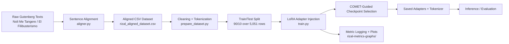

# Can You Beat Rizal?

Improving machine translation for historical Tagalog texts.

This project aligns 19th-century Tagalog passages from Jose Rizal's novels with their English translations, prepares a tokenized training dataset, and fine-tunes a Tagalog-to-English translation model with LoRA.

## System Architecture



## Project Structure

- `raw data/` - source text files for *Noli Me Tangere* and *El Filibusterismo*
- `aligner.py` - sentence alignment pipeline
- `preprocess.py` - text cleaning and preparation utilities
- `prepare_dataset.py` - dataset filtering, split, and tokenization
- `train.py` - LoRA fine-tuning script
- `evaluate_baseline.py` - baseline evaluation script
- `rizal_aligned_dataset.csv` - aligned sentence pairs
- `rizal_tokenized_dataset_normalized_tagalog/` - tokenized dataset for the normalized Tagalog variant
- `rizal_tokenized_dataset_old_tagalog/` - tokenized dataset for the older Tagalog variant
- `rizal-lora-adapters-v3-final_normalized_tagalog/` - saved adapter weights and tokenizer files
- `rizal-lora-adapters-v3-final_old_tagalog/` - saved adapter weights and tokenizer files
- `rizal-metrics-graphs_normalized_tagalog/` - training metrics history and plots
- `rizal-metrics-graphs_old_tagalog/` - training metrics history and plots

## Methodologies

This project uses a staged machine translation pipeline designed for historical Tagalog material:

1. Sentence alignment with `aligner.py` to pair Tagalog source sentences with their English translations.
2. Dataset cleaning and tokenization with `prepare_dataset.py` to build train/test splits.
3. Parameter-efficient fine-tuning with LoRA in `train.py`, which freezes the base `Helsinki-NLP/opus-mt-tl-en` weights and injects low-rank trainable adapters into the attention and feed-forward projection layers (`q_proj`, `k_proj`, `v_proj`, `out_proj`, `fc1`, `fc2`).
4. Evaluation with multiple metrics so the model is judged by both surface similarity and semantic quality.

The training data uses a 90/10 train/test split over 5,051 aligned rows from the original and normalized Tagalog-to-English datasets.

The training script uses `include_inputs_for_metrics=True`, so COMET can inspect the Tagalog source, the generated English candidate, and the reference translation together. This is important for historical translation work because meaning matters more than exact word overlap.

## Metrics

- BLEU checks strict word and phrase overlap with the reference translation. It is useful for exact matching, but it is rigid and can underrate valid synonyms.
- chrF measures character-level overlap. It is more forgiving than BLEU for spelling variation, affixes, and minor token changes.
- BERTScore compares contextual word meaning using embedding similarity. It recognizes semantic closeness better than BLEU or chrF.
- COMET evaluates source, candidate, and reference together using a neural quality model. It is the best fit for translation quality because it tracks meaning and human judgment more closely.

For this project, COMET is the main early-stopping and best-model metric because it rewards accurate, fluent translations even when the wording differs from the reference.

## Why Loss Can Mislead

During training, `eval_loss` is computed with token-level cross-entropy, so it only asks whether the model predicted the exact reference token at each step. That makes it a useful optimization signal, but it can create an overfitting illusion for translation tasks.

A model may produce a lower-quality loss score even while generating better translations, because valid synonyms, paraphrases, and more natural sentence reordering are still penalized if they do not match the reference tokens exactly. In other words, loss measures strict token agreement, not translation quality.

That is why this project does not use loss as the best-model gate. Instead, it relies on COMET, which compares the Tagalog source, the generated English candidate, and the reference translation together. This makes it much better at judging whether the model is actually learning to translate meaning, not just memorizing wording.

In practical terms:

- BLEU and chrF are lexical metrics, so they reward exact or near-exact surface overlap.
- BERTScore is better at semantic similarity, but it still evaluates candidate against reference at the token level.
- COMET is source-aware and is closer to a bilingual human evaluation.

Because of that, a rising `eval_loss` does not necessarily mean the model is getting worse at translation. It may simply mean the model is becoming less rigid and more semantically flexible, which is often the desirable direction for historical text translation.

## Improvements Made

Compared with the base multilingual translation model, this project improves the pipeline in several ways:

- It specializes a general Tagalog-to-English model for Rizal-era and historical Tagalog.
- It adds LoRA adapters instead of full fine-tuning, which keeps the original model frozen and trains only a small low-rank parameter set inside the transformer projections.
- It uses aligned sentence pairs built from the novel texts instead of generic translation data.
- It evaluates with BLEU, chrF, BERTScore, and COMET instead of relying on loss alone.
- It selects the best checkpoint using COMET, which better reflects translation quality than token-level loss.
- It logs metric history and plots so training progress can be reviewed visually.

## Requirements

- Python 3.10+
- PyTorch
- Hugging Face Transformers, Datasets, PEFT, Accelerate
- Sentence Transformers, SpaCy, Pandas, Scikit-learn
- Optional but recommended: an NVIDIA GPU with CUDA support

Install dependencies with:

```bash
pip install -r requirements.txt
```

If you plan to use the SpaCy sentence splitter, also install the multilingual model:

```bash
python -m spacy download xx_sent_ud_sm
```

## Workflow

1. Place the raw Gutenberg text files in `raw data/`.
2. Run sentence alignment:

```bash
python aligner.py
```

This produces `rizal_aligned_dataset.csv`.

3. Prepare the tokenized dataset:

```bash
python prepare_dataset.py
```

This builds the train/test dataset folders used by `train.py`.

4. Fine-tune the translation model:

```bash
python train.py
```

The training script loads `Helsinki-NLP/opus-mt-tl-en`, adds LoRA adapters, and saves the resulting weights plus metric plots.

5. Evaluate the baseline model if needed:

```bash
python evaluate_baseline.py
```

## Training Details

`train.py` fine-tunes `Helsinki-NLP/opus-mt-tl-en` with LoRA, evaluates with BLEU, chrF, BERTScore, and COMET, and writes metric history and plots into `rizal-metrics-graphs/`.

The model is saved from the checkpoint that performs best on COMET, while early stopping prevents the adapters from training long after translation quality stops improving.

Key training outputs:

- adapter weights in `rizal-lora-adapters-v3-final/`
- tokenizer files in the same adapter directory
- metric history in `metrics_history.json`
- per-metric plots as PNG files

## Notes

- The repository currently contains prebuilt dataset and adapter artifacts for both normalized and old Tagalog variants.
- If you change the dataset path or output directories in `train.py`, update the workflow above to match.
- Large model artifacts are expected; keep an eye on disk usage when re-running training.

## FAQ

**Why not use BLEU alone?**

BLEU is strict word-overlap scoring. It can punish valid synonym choices, so a good translation may look worse than it really is.

**Why include chrF?**

chrF works at the character level, so it is more forgiving for spelling variation, affixes, and historical word forms.

**Why keep BERTScore?**

BERTScore measures semantic similarity between candidate and reference translations, so it helps capture meaning even when the wording changes.

**Why is COMET the main metric?**

COMET is source-aware and trained to reflect human translation judgments. It checks the Tagalog source, the English reference, and the model output together, so it is the best fit for choosing the best checkpoint in this project.
